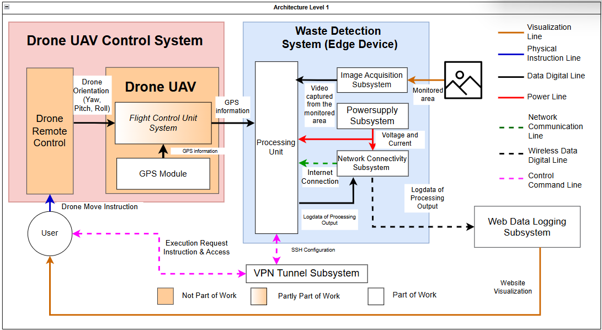

<div align="center">

  

  <p>
    <a href="https://github.com/ROBOTICS-STEI-ITB/Trash_Vision_V1/stargazers"></a>
    <a href="https://github.com/ROBOTICS-STEI-ITB/Trash_Vision_V1/network/members"></a>
    <a href="https://github.com/ROBOTICS-STEI-ITB/Trash_Vision_V1/commits/main"></a>
    
    
    
    
    
  </p>

</div>

---

> **Trash Vision** adalah sistem pendeteksi sampah berbasis drone yang dirancang untuk mendeteksi sampah secara otomatis dan real-time. Sistem ini menggunakan model computer vision YOLOv8 yang berjalan di atas Raspberry Pi 5 dengan akselerator AI on-board, sistem ini mampu mengirimkan hasil deteksi berupa lokasi (Nama beserta koordinat GPS), timestamp, gambar teranotasi, serta hasil deteksi dan klasifikasi ke situs pengguna.

---

## 📋 Quick Navigation

| Bagian | Deskripsi |
|---|---|
| [Tentang Proyek](#-tentang-proyek) | Latar belakang, motivasi, dan tujuan sistem |
| [Arsitektur Sistem](#-arsitektur-sistem) | Komponen hardware dan alur kerja keseluruhan |
| [Tech Stack](#-tech-stack) | Teknologi, framework, dan library yang digunakan |
| [Fitur Utama](#-fitur-utama) | Kemampuan dan fitur yang tersedia |
| [Instalasi & Setup](#-instalasi--setup) | Cara menyiapkan dan menjalankan sistem |
| [Cara Penggunaan](#-cara-penggunaan) | Panduan operasional sistem |
| [Hasil & Evaluasi](#-hasil--evaluasi) | Metrik performa model deteksi |
| [Struktur Repositori](#-struktur-repositori) | Penjelasan direktori dan file |

---

## 🌍 Tentang Proyek

Berdasarkan data Direktorat Jenderal Pengendalian Pencemaran dan Kerusakan Lingkungan (Ditjen PPKL) dan KLHK, **59% sungai di Indonesia tercemar berat** oleh berbagai jenis sampah seperti botol plastik dan kaleng. Tim peneliti dari Institut Teknologi Bandung (ITB) melakukan sampling sampah menggunakan drone UAV di area-area terdampak.

Namun dalam praktiknya, drone yang ada di lab saat ini hanya berfungsi sebagai alat **perekam video mentah**. Seluruh analisis mulai dari pemindahan data, menonton video, hingga klasifikasi sampah masih dilakukan secara manual. Sebagai contoh, untuk video berdurasi **15 detik** saja, waktu analisis manual bisa mencapai **200 detik**. Alur kerja ini dinilai lambat dan tidak efisien.

**Trash Vision** hadir sebagai solusi dengan mengimplementasikan **edge device** yang melakukan komputasi computer vision secara **on-board** langsung di atas drone UAV, sehingga sistem mampu:

- 🔍 **Mendeteksi & mengklasifikasikan sampah** (botol plastik, kaleng, tumpukan daun) secara otomatis
- ⚡ **Melakukan inferensi on-board** menggunakan Raspberry Pi 5 + AI HAT 26 TOPS (14.8ms)
- 📷 **Melakukan anotasi gambar hasil deteksi** dengan bounding box beserta jenis sampahnya
- 🔋 **Memiliki power supply independen** terpisah dari baterai drone agar tidak membebani durasi terbang
- 📡 **Diakses melalui SSH** over Tailscale untuk kontrol sistem secara wireless
- 📊 **Log data otomatis** berisi jenis & jumlah sampah, koordinat GPS, timestamp, nama lokasi, dan gambar teranotasi yang dikirim ke website pengguna

> 💡 Proyek ini dikembangkan sebagai **Tugas Akhir** di Sekolah Teknik Elektro dan Informatika, **Institut Teknologi Bandung (ITB)**, dengan fokus implementasi sistem pendeteksi sampah pada edge device yang terpasang pada drone UAV.

---

## Informasi Terbaru

- **2026-07-02**: **Repository sistem pendeteksi sampah V1** — pembuatan repository `Trash-Vision-V1` sebagai dokumentasi dari hasil tugas akhir kelompok TA25260127 beserta panduan setup dan juga instalasi sistem.

---

## 🏗️ Arsitektur Sistem

<div align="center">
  
</div>

### Alur Kerja Sistem

1. Drone dan modul edge device dinyalakan  
2. Drone terbang ke area pemantauan
3. Pengguna mengakses modul perangkat edge secara wireless
4. Pengguna menjalankan program deteksi sampah
5. Kamera menangkap video dari area pengamatan
6. Unit pemrosesan melakukan deteksi (inferensi) menggunakan model AI
7. Sistem membuat data log berdasarkan hasil pemrosesan
8. Data log dikirim ke situs pengguna 
---

## 🛠️ Kebutuhan Sistem

### Perangkat Keras

| Komponen | Spesifikasi |
|---|---|
| **Drone** | Set Drone Holybro X500 V2 |
| **Single Board Computer** | Raspberry Pi 5 16 GB |
| **Cooler** | Raspberry Pi Active Cooler |
| **AI Accelerator** | Raspberry Pi AI HAT+ 26 TOPS |
| **Casing** | 52Pi Raspberry Pi 5 Metal Case |
| **Kamera** | Raspberry Pi Camera Module 3 |
| **Kabel Kamera** | FPC 22-Way to 15-Way for Camera - 50cm |
| **Power Supply** | UNEED Mini Powerbank 10.000mAh 22.5W – CompactBox N10 UPB247 |
| **Kamera** | Raspberry Pi Camera Module 3 |
| **Modem** | Modem USB 4G LTE |
| **Serial Converter** | FT232 FTDI USB to TTL |


### Software & Library

| Kategori | Teknologi |
|---|---|
| **Bahasa Pemrograman** | Python 3.10+ |
| **Model Deteksi** | YOLO (YOLOv8 saat ini) |
| **Computer Vision** | OpenCV |
| **Numerik** | NumPy |
| **Flight Control** | MAVLink / DroneKit *(sesuaikan)* |
| **Backend** | Flask / FastAPI *(sesuaikan)* |
| **Visualisasi** | *(Folium / Leaflet / Sesuaikan)* |

---

## 🎮 Cara Penggunaan (Sudah pernah setup atau seluruh perangkat keras dan perangkat lunak sudah siap)

> [!NOTE]
> Pastikan edge device sudah menyala dan memiliki akses internet dengan indikator modem yang aktif sebelum menjalankan perintah berikut.

> [!NOTE]
> Berikut cara mengetahui [`raspberry pi username`](#cek-username) dan [`<raspberry pi tailscale-ip>`](#cek-ip-tailscale).

### Menghubungkan ke SSH Edge Device
Akses edge device secara remote via SSH melalui CMD pada PC pengguna. 
```bash
ssh <raspberry pi username>@<raspberry pi tailscale-ip>
```

<details>
<summary>✅ Output yang diharapkan</summary>

```
100.x.x.x   raspberrypi   tagged-devices   active; relay "sin"
```
</details>

<details>
<summary>✅ Cara memeriksa `username raspberry pi` </summary> 

```
100.x.x.x   raspberrypi   tagged-devices   active; relay "sin"
```
</details>


### Menjalankan Sistem Deteksi

```bash
# Jalankan sistem deteksi utama
python src/main.py

# Dengan mode verbose (tampilkan bounding box di layar)
python src/main.py --display

# Deteksi dari file video (untuk testing)
python src/main.py --source path/to/video.mp4
```

### Menjalankan Backend

```bash
# Jalankan backend server
python backend/app.py

# Server akan berjalan di http://localhost:5000
```

### Testing Model

```bash
# Test inferensi pada gambar statis
python src/detect.py --image path/to/image.jpg --model models/trash_detection.pt

# Evaluasi performa model pada dataset test
python src/evaluate.py --dataset data/test/
```

---

## 🚀 Instalasi & Setup

### Prasyarat

```bash
# Python 3.10 atau lebih baru
python --version

# pip (package manager)
pip --version
```

### Instalasi Dependencies

```bash
# Clone repositori
git clone https://github.com/[username]/trash-vision.git
cd trash-vision

# Buat virtual environment
python -m venv venv
source venv/bin/activate  # Linux/macOS
venv\Scripts\activate     # Windows

# Install dependencies
pip install -r requirements.txt
```

### Setup Model

```bash
# Letakkan file model YOLO (.pt) ke direktori berikut:
mkdir -p models/
# Contoh: models/trash_detection.pt
```

### Konfigurasi

Salin file konfigurasi contoh dan sesuaikan dengan setup Anda:

```bash
cp config/config.example.yaml config/config.yaml
```

Edit `config/config.yaml`:

```yaml
model:
  path: "models/trash_detection.pt"
  confidence_threshold: 0.5

camera:
  source: 0  # 0 untuk webcam, atau path ke video file

gps:
  port: "/dev/ttyUSB0"
  baudrate: 9600

backend:
  url: "http://localhost:5000/api/detection"
```

---

## 📈 Hasil & Evaluasi

Model deteksi sampah dievaluasi menggunakan metrik standar computer vision:

| Metrik | Nilai |
|---|---|
| **Precision** | *(Hasil evaluasi Anda)* |
| **Recall** | *(Hasil evaluasi Anda)* |
| **F1-Score** | *(Hasil evaluasi Anda)* |
| **mAP@0.5** | *(Hasil evaluasi Anda)* |

> 📝 **Catatan**: Evaluasi dilakukan pada dataset yang dikumpulkan khusus untuk pemantauan sampah di lingkungan perairan Indonesia.

<!-- Tambahkan screenshot/gambar hasil deteksi di sini -->
<!--
### Contoh Hasil Deteksi

<div align="center">
  
  <br/>
  <em>Contoh deteksi sampah dari perspektif udara dengan bounding box dan confidence score</em>
</div>
-->

---

## 📁 Struktur Repositori

```
trash-vision/
├── assets/                  # Gambar, logo, dan media dokumentasi
├── config/                  # File konfigurasi sistem
│   └── config.example.yaml
├── data/                    # Dataset (tidak disertakan di repo)
│   ├── train/
│   ├── val/
│   └── test/
├── models/                  # Model YOLO yang telah dilatih
├── src/                     # Source code utama
│   ├── main.py              # Entry point sistem deteksi
│   ├── detect.py            # Modul inferensi YOLO
│   ├── preprocess.py        # Pipeline preprocessing gambar
│   ├── gps.py               # Modul komunikasi GPS
│   └── transmitter.py       # Modul pengiriman data ke backend
├── backend/                 # Backend API server
│   └── app.py
├── notebooks/               # Jupyter notebooks (training, analisis)
├── tests/                   # Unit tests
├── requirements.txt         # Python dependencies
└── README.md
```

---

## 📄 Lisensi

Proyek ini dilisensikan di bawah [MIT License](LICENSE).

---

## 🤝 Kontributor

**Kelompok** : TA25260127
**Anggota** :
1. Naufal Afiq Muzaffar (13222025)  
2. Olivia Alexandra Silalahi (13222082)
   
**Pembimbing** :
1. Anggera Bayuwindra, S.T., M.T., Ph.D. 
2. Nana Sutisna, S.T., M.T., Ph.D.
3. Ishak Hilton Pujantoro Tnunay, Ph.D. 

---
